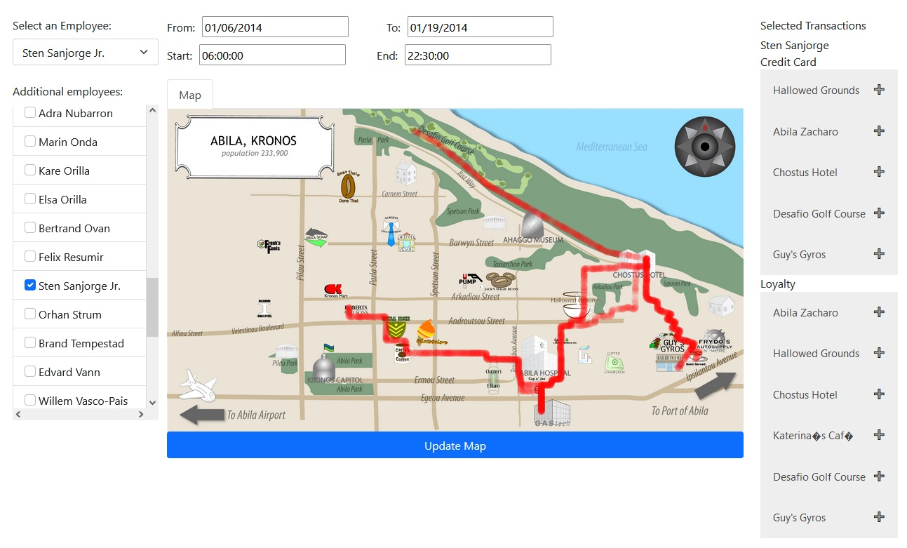

# CSE 557 Assignment 2
https://kfjustis.github.io/cse557a-bjl.github.io/

## Instructions

### Single-employee Queries
When the page loads, select an employee with the "Select an Employee" dropdown. Then,
set the query time range using the controls above the map. Click the "Update Map" button
beneath the map to run the query and wait for the data to appear. If no data is found, or too
much data is found, an alert dialog will appear to indicate the error. Narrow the query to a
smaller time range and repeat the same steps to search for data again.

### Multi-employee Queries
Multiple employees can be selected for a query as well. To do this, choose the main employee
again with the dropdown and then add additional employees using the checkboxes on the left
side of the page. Modify the query time range if necessary and click "Update Map" to retrieve
the new data for all selected employees.

### Employee Record Data
Relevant credit card and loyalty data for each employee (within the given time range) is
displayed on the right side of the page assuming any such data is found.

### Usability Notes
Up to 80,000 data points are supported for a single query. If a query is made that results in
this much data, it can take around 30-40 seconds to re-render the data.

Refresh the page to reset everything and return to the default page state.

## Group Members

* Pratyay Bishnupuri
* Will LeVan
* Kynan Justis